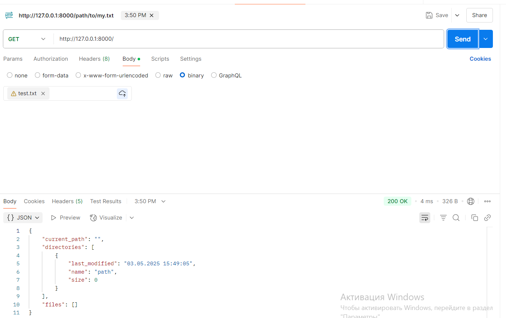
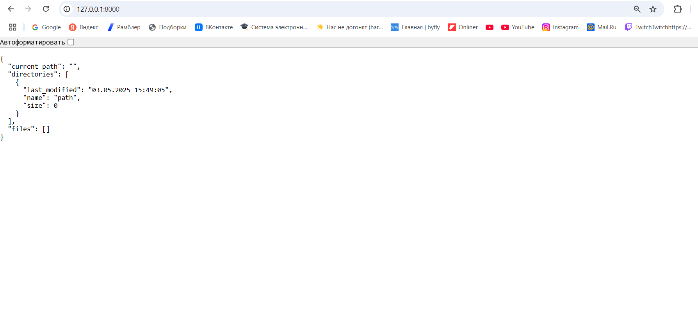
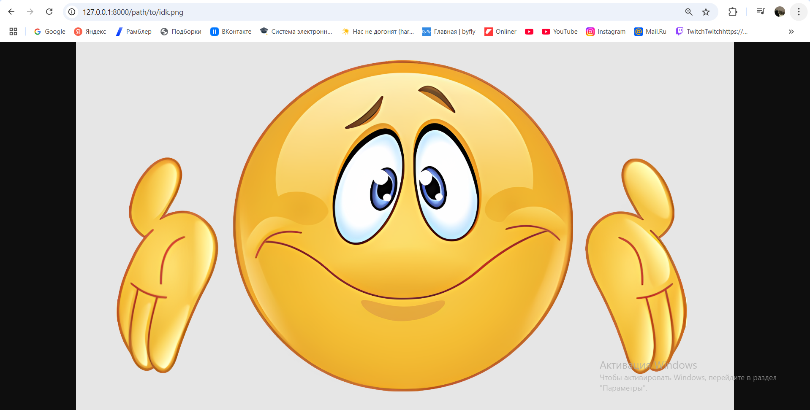
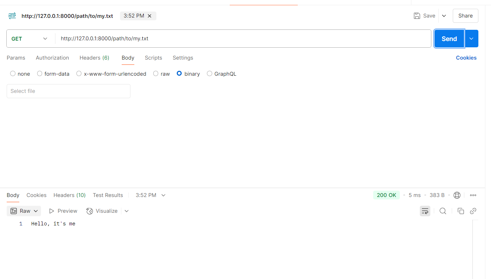
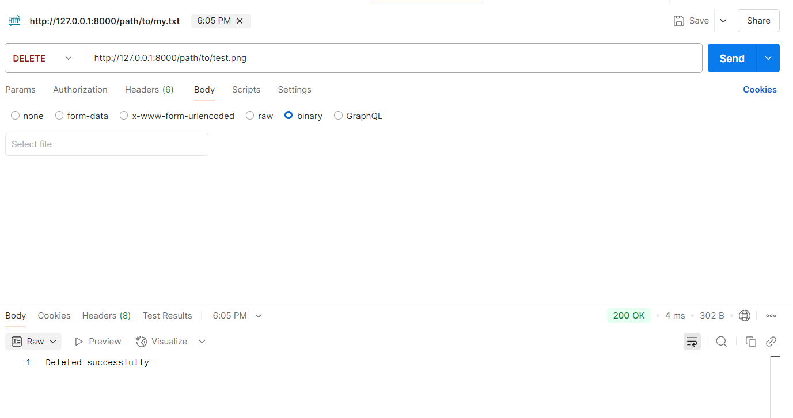
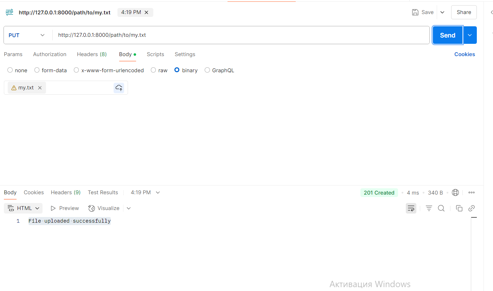
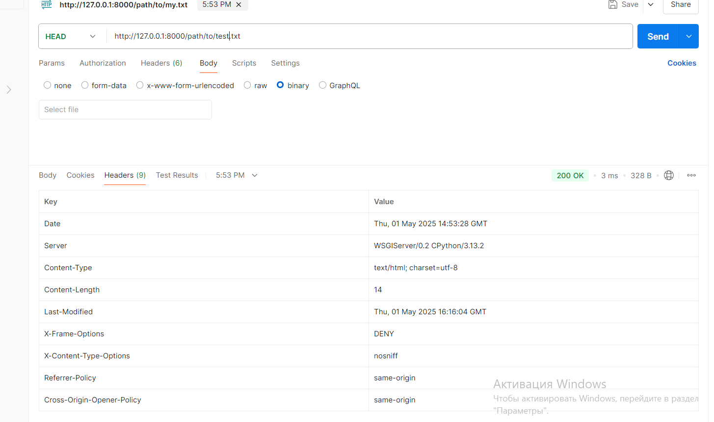

# Отчёт

## Метод GET к корневому URL в Postman 

## Вид корневого URL на сайте

## Метод GET для png по его URL на сайте

## Метод GET для txt файла в Postman

## Метод DELETE в Postman 

## Метод PUT в Postman 

## Метод HEAD в Postman 

